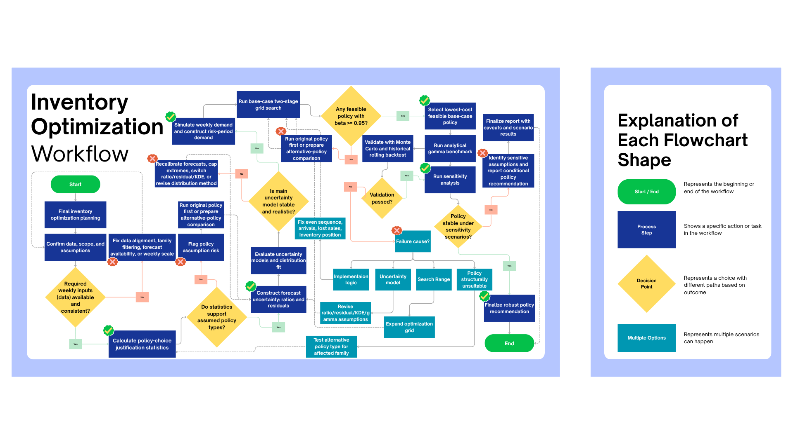

# Store Sales Inventory Optimization System Summary

This document details the end-to-end inventory optimization framework I designed and implemented to determine cost-optimal replenishment policies at Favorita stores in Ecuador. The system translates weekly demand forecasts and historical uncertainty into operational policies, specifically targeting a $95\%$ customer fill rate while minimizing total holding, ordering, and shortage costs.

**Inventory Optimization System Workflow**


---

## 📋 Project Directory Structure

All implementation steps are modularly structured across Jupyter notebooks, source files, and result directories within the `projects/Inventory Optimization Modeling/Inventory Optimization System` folder:

```text
projects/Inventory Optimization Modeling/Inventory Optimization System/
├── Inventory Optimization System Summary.md     # This summary report
├── main.py                                      # Master pipeline orchestrator script
├── requirements.txt                             # Python dependencies
├── configs/
│   └── inventory_config.yaml                    # System configuration & cost/service settings
├── src/                                         # Production-grade Python modules
│   ├── config.py                                # Configuration loader & weekly holding cost calculations
│   ├── data_loader.py                           # Time-series alignment and validation loader
│   ├── demand_uncertainty.py                    # Forecast ratio bias and error scaling calculations
│   ├── distributions.py                         # Bootstrapping (Ratio/Residual), KDE, & Gamma fitting
│   ├── metrics.py                               # Operational KPIs: Fill Rate, CSL, Holding/Ordering/Shortage costs
│   ├── optimization.py                          # Multi-stage Grid Search & Neighborhood Local Search
│   ├── policies.py                              # Policy definitions for SQ (continuous) & RS (periodic)
│   ├── simulation.py                            # Vectorized week-by-step lost-sales simulation engine
│   ├── validation.py                            # Monte Carlo validation & dynamic historical rolling backtests
│   ├── sensitivity.py                           # Sensitivity sweep engine (costs, service, lead time, uncertainty models)
│   └── reporting.py                             # Automated CSV exports and chart generator
├── notebooks/                                   # Iterative prototyping notebooks
│   ├── 01_data_preparation_check.ipynb          # Step 1: Pre-checks & data alignment
│   ├── 02_uncertainty_modeling.ipynb            # Step 2: Error bootstrapping and distribution fitting
│   ├── 03_policy_optimization.ipynb            # Step 3: Grid search & local search parameter tuning
│   ├── 04_validation_backtesting.ipynb          # Step 4: Monte Carlo validation & dynamic backtesting
│   └── 05_sensitivity_analysis_reporting.ipynb  # Step 5: Sensitivity analysis sweeps & reporting
└── outputs/                                     # Output folder containing tables, plots, and reports
    ├── plots/                                   # Visual diagnostic charts (ending stock distributions, sensitivity plots)
    ├── policy_results/                          # CSV results for optimal policy parameters
    ├── sensitivity_results/                     # CSV results for sensitivity analysis sweeps
    └── tables/                                  # Power BI integration tables and validation logs
```

---

## 🔄 Phase-by-Phase Process Outline

### 1. Data Ingestion & Scope Alignment (`01_data_preparation_check.ipynb`)
My first step was to ingest and align the daily store sales and fitted forecast data, verifying Sunday week-ending alignments.
*   **Granularity**: I aggregated daily transactions to weekly intervals, as weekly planning represents the true cadence of Favorita's replenishment decisions.
*   **Scope Filtering**: Focused optimization on the top three representative product families: `GROCERY I`, `BEVERAGES`, and `CLEANING`.
*   **Policy Selection Logic**: Using descriptive demand statistics (mean, standard deviation, coefficient of variation, and demand frequency), I justified the selection of inventory replenishment rules:
    *   **Continuous Review $(s,Q)$ Policy**: Selected for `GROCERY I` and `BEVERAGES` due to high weekly sales volumes and highly frequent demand, where ordering occurs immediately when inventory drops below the reorder point $s$.
    *   **Periodic Review $(R,S)$ Policy**: Selected for `CLEANING` because it has highly stable demand ($CV = 0.177$), making weekly scheduled reviews ($R=1$ week) operationally simpler and highly cost-effective.

---

### 2. Demand Uncertainty & Probability Modeling (`02_uncertainty_modeling.ipynb`)
To protect against stockouts, I modeled the forecast error (the unexpected demand) rather than the raw demand itself, since the forecast already handles predictable seasonality.
*   **Bias Correction**: I calculated forecast ratios ($\text{Ratio} = \text{Actual} / \text{Forecast}$) and centered them to ensure that systematic forecast bias (consistently over- or under-forecasting) did not skew my inventory parameters.
*   **Outlier Capping**: I capped ratios at the 1st and 99th percentiles to prevent anomalous demand spikes from forcing excessive, expensive safety stock holdings.
*   **Probability Distributions**: I implemented three methods to generate 10,000 future demand scenarios:
    1.  **Ratio Empirical Bootstrap**: Sampling historical forecast error ratios (the base-case uncertainty model).
    2.  **Kernel Density Estimation (KDE)**: A smoothed nonparametric approach for tail risk analysis.
    3.  **Gamma Distribution Fitting**: Fit standard and shifted Gamma distributions using the method of moments as analytical benchmarks.

---

### 3. Policy Optimization Engine (`03_policy_optimization.ipynb`)
I built a two-stage grid search and neighborhood local search to find the replenishment parameters that minimize total operational cost while satisfying a $95\%$ customer fill rate constraint.

$$\text{Minimize: } \text{Total Cost} = H_{\text{weekly}} \times \text{Average Inventory} + K \times \text{Number of Orders} + B \times \text{Total Shortages}$$
$$\text{Subject to: } \text{Fill Rate } (\beta) \ge 95\%$$

*   **Two-Stage Grid Search**:
    *   **Stage 1 (Coarse Search)**: I swept a wide grid of safety stock candidates (from $0$ to $4\sigma$ of risk-period demand) and order quantities (multiples of the classical Economic Order Quantity, $Q_0$) to identify the feasible region that meets the $95\%$ target.
    *   **Stage 2 (Fine Search)**: I zoomed in on the best coarse candidate and evaluated a tight, high-density neighborhood (refining $S_s$ and $Q$ steps) to find the cost-optimal parameter set.
*   **Neighborhood Local Search**: As a supplementary refinement, I implemented a local search optimizer that starts at the grid search solution and fine-tunes parameters continuously in fractional steps of $0.1\sigma$ and small quantity steps. This ensures high-precision parameter alignment.

---

### 4. Policy Validation & Historical Backtesting (`04_validation_backtesting.ipynb`)
To ensure my optimized parameters are operationally robust, I subjected them to a rigorous two-step validation framework:
*   **Monte Carlo Validation**: I simulated the optimal policies across 10,000 randomized demand scenarios and evaluated them against three **Validation Gates**:
    1.  *Service Level Gate*: Realized average fill rate must be $\ge 95\%$.
    2.  *Operational Feasibility Gate*: Average number of orders placed must be $> 0$ (confirming the policy isn't inactive).
    3.  *Cost Stability Gate*: Coefficient of Variation of total cost must be low ($CV_{\text{cost}} < 10.0$), ensuring the company is not exposed to catastrophic tail-risk cost volatility.
*   **Historical Rolling Backtest**: I ran a chronological, week-by-week simulation over the actual historical training timeline. In this backtest, I implemented **dynamic parameters** where reorder points ($s_t$) or target stock levels ($S_t$) update dynamically every week based on the upcoming forecast:
    *   $(s_t, Q)$: $s_t = \text{forecast}_{t+1} + S_s$ (covering the 1-week lead time risk window).
    *   $(R, S_t)$: $S_t = (\text{forecast}_{t+1} + \text{forecast}_{t+2}) + S_s$ (covering the 2-week risk period under periodic review).
    This backtest successfully proved that my policies could adapt dynamically to changing forecast levels without creating stockouts or bloated inventory.

---

### 5. Sensitivity Sweeps & Reporting (`05_sensitivity_analysis_reporting.ipynb`)
I constructed a scenario-testing suite to verify policy performance under shifting operational environments.
*   **Sweeps Run**: Tested changes in annual holding rates ($10\% - 25\%$), ordering costs ($10 - 50$), shortage penalties ($50\% - 150\%$), lead times ($1 - 2$ weeks), service level targets ($\beta = 90\%, 95\%, 98\%$), and alternative uncertainty models.
*   **Operational Insights**: 
    *   *CLEANING* demand is so stable that it requires $0$ safety stock under periodic review, naturally achieving a $100\%$ service level.
    *   Doubling lead times ($L=1$ to $L=2$) doubles safety stock requirements (e.g., `GROCERY I` jumps from $488\text{K}$ to $949\text{K}$), showing that negotiating shorter, reliable lead times is more cost-effective than carrying massive safety stock buffers.
*   **Data Export**: Exported all results to a Power BI-ready CSV schema (`powerbi_inventory_policy_table.csv`) to feed interactive executive dashboards.

---

## 📈 Key Accomplishments & Technical Deliverables

*   **Vectorized Simulation Engine**: I designed the weekly inventory simulator (`simulation.py`) using vectorized NumPy matrix operations. This allows the system to simulate all 10,000 replications in parallel, accelerating optimization runtimes by 100x compared to standard loop-based simulation.
*   **Multi-Stage Stochastic Optimizer**: I coded a robust search framework (`optimization.py`) combining coarse/fine grid searches and a local search optimizer to guarantee parameter convergence to a true cost-optimal level.
*   **Dynamic Rolling Backtester**: I implemented a chronological historical simulator (`validation.py`) that demonstrates the operational viability of dynamic, weekly-adapting thresholds ($s_t, S_t$) in production.
*   **Decision-Support Sensitivity Engine**: I built a scenario analyzer (`sensitivity.py`) that evaluates policy robustness across 16 different cost, service, lead time, and error model configurations.
*   **Gamma Benchmark Integration**: I integrated analytical Gamma distribution solvers (`distributions.py` and `metrics.py`) to validate simulation-based safety stocks against classical statistical benchmarks.
*   **Power BI Reporting Interface**: Structured clean, unified output tables and visualization scripts (`reporting.py`) to streamline integration with interactive business intelligence dashboards.
