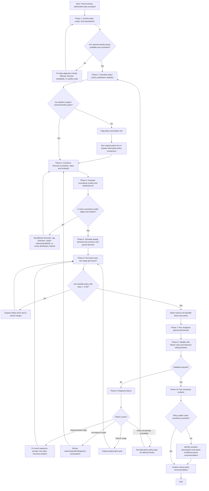

# Inventory Optimization Workflow Process  
## Based on `inventory_optimization_plan_final.md`

---

## 0. Purpose of This Workflow Document

This document converts the final inventory optimization plan into an executable workflow-control process. The objective is to give a clear sequence of work so the inventory optimization model can be implemented, checked, validated, revised, and reported systematically.

The workflow is presented in two levels:

1. **General workflow level** — a high-level process map showing the major phases, decision points, iterations, and outputs.
2. **Detailed workflow level** — a step-by-step execution checklist describing what must be done inside each phase, what decisions must be made, what evidence must be checked, and when the process must loop back.

This workflow does **not** include coding. It is intended to control the modeling process before implementation.

---

## 1. Core Modeling Commitments from the Final Plan

Before the workflow begins, the following decisions are treated as the base-case commitments.

| Modeling Component | Base-Case Decision |
|---|---|
| Demand time scale | Weekly demand only |
| Daily demand usage | Excluded |
| Product families | `GROCERY I`, `BEVERAGES`, `CLEANING` |
| Policy for `GROCERY I` | Continuous review policy: $(s,Q)$ |
| Policy for `BEVERAGES` | Continuous review policy: $(s,Q)$ |
| Policy for `CLEANING` | Periodic review policy: $(R,S)$ |
| Lead time | $L=1$ week |
| Review period | $R=1$ week for periodic review |
| Risk period for $(s,Q)$ | $\tau=L=1$ week |
| Risk period for $(R,S)$ | $\tau=R+L=2$ weeks |
| Main service metric | Fill rate $\beta$ |
| Target fill rate | $\beta \geq 0.95$ |
| Secondary service metric | Cycle service level / CSL |
| Main uncertainty source | Weekly forecast ratios or weekly residuals |
| Main distribution method | Empirical bootstrap baseline; KDE as comparison |
| Analytical benchmark | Common gamma and shifted gamma |
| Main optimization method | Two-stage grid search |
| Exploratory optimization method | Threshold/local search |
| Main validation methods | Monte Carlo validation and historical rolling backtest |
| Main shortage assumption | Lost sales |
| Unit cost | Normalized unit cost $c=1$ |

---

# Part I — General Workflow Level

## 2. General Workflow Overview

The complete workflow contains ten major phases.

| Phase | Phase Name | Main Purpose | Main Output |
|---:|---|---|---|
| 1 | Data and scope confirmation | Confirm that all inputs and modeling assumptions are aligned with the final plan. | Clean workflow-ready input list |
| 2 | Policy-choice justification | Support the assumed policy type using descriptive demand statistics. | Policy justification table |
| 3 | Forecast-uncertainty construction | Separate expected demand from unexpected demand uncertainty. | Weekly ratio/residual datasets |
| 4 | Uncertainty-model selection | Decide whether ratio bootstrap, residual bootstrap, KDE, or gamma benchmark is appropriate. | Selected main uncertainty model and benchmark models |
| 5 | Risk-period demand construction | Convert simulated weekly demand into risk-period demand. | $D_\tau^{sim}$ for each family |
| 6 | Base-case policy optimization | Optimize safety stock, reorder point/order-up-to level, and order quantity where applicable. | Base-case optimized policy parameters |
| 7 | Analytical gamma benchmark | Compare simulation solution against a classical gamma-based inventory benchmark. | Gamma benchmark policy estimates |
| 8 | Validation | Check whether the optimized policy actually satisfies service, cost, and operational criteria. | Validation results and pass/fail decision |
| 9 | Iteration and revision | Diagnose failures and rerun the necessary part of the workflow. | Revised model or revised policy assumption |
| 10 | Sensitivity analysis and final reporting | Test robustness and prepare final recommendation. | Final robust policy recommendation |

---

## 3. General Workflow Diagram

---

## 4. General Decision-Gate Logic

The workflow must not move forward automatically. Each major phase has a decision gate.

| Gate | Question | If Yes | If No |
|---|---|---|---|
| Gate 1 | Are weekly data, forecasts, families, and policy assumptions correctly prepared? | Proceed to policy justification. | Fix data/scope alignment and repeat Phase 1. |
| Gate 2 | Are the assumed policy types defensible? | Proceed with base assumptions. | Flag policy risk and prepare alternative-policy comparison. |
| Gate 3 | Are ratio/residual uncertainty models unbiased and stable enough? | Proceed to simulation. | Recalibrate, cap extremes, or switch uncertainty model. |
| Gate 4 | Does the selected distribution generate realistic simulated weekly demand? | Construct risk-period demand. | Use empirical bootstrap/KDE or revise distribution choice. |
| Gate 5 | Does the grid search find at least one feasible policy satisfying $\beta \geq 0.95$? | Select lowest-cost feasible policy. | Expand search range and rerun optimization. |
| Gate 6 | Does validation confirm service, cost, inventory, and order-pattern reasonableness? | Proceed to sensitivity analysis. | Diagnose failure and rerun the affected workflow phase. |
| Gate 7 | Is the selected policy stable under sensitivity analysis? | Finalize robust recommendation. | Report sensitivity-dependent recommendation or revise assumptions. |

---

# Part II — Detailed Workflow Level

## 5. Phase 1 — Data and Scope Confirmation

### 5.1 Objective

Confirm that the project is using the correct product families, weekly demand scale, forecast outputs, assumptions, and cost parameters before any optimization is conducted.

### 5.2 Required Inputs

| Input | Required Content | Purpose |
|---|---|---|
| Historical actual weekly sales | Weekly actual sales by product family | Used for descriptive statistics, residuals/ratios, and rolling backtest |
| Historical fitted weekly sales | Fitted weekly demand from forecasting models | Used to estimate historical forecast errors or ratios |
| Test weekly forecasts | Forecasted weekly demand for approximately three test weeks | Used as the expected future demand path |
| Product family list | `GROCERY I`, `BEVERAGES`, `CLEANING` | Defines optimization scope |
| Policy assignment | $(s,Q)$ for `GROCERY I` and `BEVERAGES`; $(R,S)$ for `CLEANING` | Defines risk period and decision variables |
| Cost assumptions | $h_{annual}=15\%$, $K=25$, family-specific $B$, $c=1$ | Defines base-case cost model |
| Service target | $\beta=0.95$ | Defines feasibility constraint |

### 5.3 Detailed Tasks

1. Confirm that all demand data are weekly, not daily.
2. Confirm that the selected families are exactly:
   - `GROCERY I`
   - `BEVERAGES`
   - `CLEANING`
3. Confirm that fitted weekly values exist for the historical period.
4. Confirm that forecasted weekly values exist for the test period.
5. Confirm that actual weekly sales and fitted weekly sales are aligned by:
   - Product family
   - Week
   - Same date/week index
6. Confirm that no daily forecast or daily disaggregation is used.
7. Confirm that lead time is fixed at $L=1$ week.
8. Confirm that review period is fixed at $R=1$ week for `CLEANING`.
9. Confirm that the model uses lost sales in the base case.
10. Confirm normalized unit cost:

$$
c=1
$$

11. Calculate base weekly holding cost:

$$
H_{week}=1\cdot \frac{0.15}{52}=0.0028846
$$

### 5.4 Gate 1 — Data Readiness Decision

| Condition | Decision |
|---|---|
| All weekly actual, fitted, and forecasted values are aligned | Proceed to Phase 2 |
| Missing fitted values or forecasted values | Stop and repair data preparation |
| Daily data are accidentally used | Stop and convert workflow back to weekly only |
| Product family names do not match exactly | Stop and standardize family labels |
| Cost assumptions are missing | Fill base assumptions before optimization |

---

## 6. Phase 2 — Policy-Choice Justification

### 6.1 Objective

Support the initial policy assumptions using simple weekly descriptive statistics. This phase does not prove global policy optimality; it makes the assumptions defensible.

### 6.2 Statistics to Calculate

For each selected family, calculate:

$$
\mu_w = E[D_w]
$$

$$
\sigma_w = SD(D_w)
$$

$$
CV=\frac{\sigma_w}{\mu_w}
$$

$$
\text{Demand Frequency}=\frac{\#(D_w>0)}{n}
$$

$$
\text{Zero-Demand Frequency}=\frac{\#(D_w=0)}{n}
$$

### 6.3 Required Policy-Justification Table

| Product Family | Mean Weekly Demand | Weekly Std. Dev. | Weekly CV | Demand Frequency | Zero-Demand Frequency | Assumed Policy | Interpretation |
|---|---:|---:|---:|---:|---:|---|---|
| GROCERY I | To calculate | To calculate | To calculate | To calculate | To calculate | $(s,Q)$ | High-volume/frequent demand should support continuous review if confirmed. |
| BEVERAGES | To calculate | To calculate | To calculate | To calculate | To calculate | $(s,Q)$ | High-volume/frequent demand should support continuous review if confirmed. |
| CLEANING | To calculate | To calculate | To calculate | To calculate | To calculate | $(R,S)$ | Weekly review is defensible if demand is less frequent or operationally less urgent. |

### 6.4 Interpretation Rules

| Evidence Pattern | Interpretation |
|---|---|
| High mean demand and high demand frequency | Supports continuous review $(s,Q)$ |
| Low zero-demand frequency | Supports regular replenishment logic |
| Moderate or low CV with high demand frequency | Supports predictable continuous replenishment |
| Lower demand frequency or greater operational tolerance | Supports periodic review $(R,S)$ |
| Very high CV or unstable demand | Requires stronger safety-stock validation and sensitivity analysis |

### 6.5 Gate 2 — Policy Assumption Decision

| Result | Action |
|---|---|
| Statistics support the assumed policy type | Continue to Phase 3 using original policy assumptions |
| Statistics weakly support the assumed policy type | Continue, but flag policy assumption risk in the report |
| Statistics contradict the assumed policy type | Continue with the original policy as the base scenario, but prepare an alternative-policy comparison |

### 6.6 Iteration Rule If Policy Type Appears Unsuitable Later

If validation or sensitivity analysis later shows that the assumed policy type is unsuitable, return to this phase and run an alternative-policy scenario.

| Product Family | Original Policy | Alternative Scenario |
|---|---|---|
| GROCERY I | $(s,Q)$ | Test $(R,S)$ with $R=1$ |
| BEVERAGES | $(s,Q)$ | Test $(R,S)$ with $R=1$ |
| CLEANING | $(R,S)$ | Test $(s,Q)$ |

Changing the policy type requires rerunning the workflow because it changes:

1. The risk period $\tau$.
2. The decision variables.
3. The order rule.
4. The inventory event sequence consequences.
5. The service-level and cost behavior.

---

## 7. Phase 3 — Forecast-Uncertainty Construction

### 7.1 Objective

Separate expected weekly demand from unexpected demand uncertainty. The model must not use raw weekly demand variation as the main safety-stock input because raw demand contains predictable patterns already captured by the forecasting model.

### 7.2 Expected Demand Path

Use the weekly forecast as the expected weekly demand path:

$$
\hat{D}_w
$$

For the test period, use the weekly test forecast as the expected future path.

### 7.3 Construct Multiplicative Forecast Ratios

For each family and historical week:

$$
r_w=\frac{D_w}{\max(\hat{D}_w,\epsilon)}
$$

where $\epsilon$ prevents division by zero or near-zero forecasts.

### 7.4 Construct Additive Forecast Residuals

For each family and historical week:

$$
e_w=D_w-\hat{D}_w
$$

### 7.5 Bias Checks

For the ratio model:

$$
E[r_w]\approx 1
$$

For the residual model:

$$
E[e_w]\approx 0
$$

### 7.6 Bias Correction Logic

| Problem | Possible Correction |
|---|---|
| Mean ratio is materially above or below 1 | Calibrate forecast using $\hat{D}_w^{calibrated}=\hat{D}_w\cdot \bar{r}$ or center ratios using $r_w/\bar{r}$ |
| Mean residual is materially different from 0 | Recalibrate forecast or center residuals |
| Forecast path creates unrealistic near-zero denominator | Increase $\epsilon$ carefully or use residual model instead |
| Ratio model produces extreme demand spikes | Winsorize/cap ratios |
| Residual model produces many negative simulated demands | Use truncation at zero or consider ratio model/KDE |

### 7.7 Extreme-Value Treatment

For ratios, compare at least these options:

$$
r_w^{capped}\in[P_1(r),P_{99}(r)]
$$

and:

$$
r_w^{capped}\in[P_{2.5}(r),P_{97.5}(r)]
$$

Also keep an uncapped version for sensitivity comparison if it does not generate unrealistic results.

### 7.8 Gate 3 — Forecast-Uncertainty Readiness Decision

| Condition | Decision |
|---|---|
| Ratio model is unbiased, stable, and realistic | Use ratio bootstrap as the main model |
| Residual model is more stable than ratio model | Use residual bootstrap as the main model |
| Both are plausible | Use one as main model and the other as sensitivity/comparison |
| Both are unstable | Recheck forecasting outputs, cap extremes, or use KDE/bootstrap alternatives carefully |

---

## 8. Phase 4 — Distribution and Uncertainty-Model Selection

### 8.1 Objective

Choose the distribution method that will generate realistic weekly simulated demand and reliable upper-tail behavior for safety-stock optimization.

### 8.2 Candidate Approaches

| Approach | Role in Workflow |
|---|---|
| Empirical bootstrap of ratios | Main simple baseline if ratio model is stable |
| Empirical bootstrap of residuals | Main alternative if residual model is more stable |
| KDE | Smoothed nonparametric alternative |
| Common gamma | Analytical benchmark |
| Shifted gamma with $c=0$, $P_1(D_w)$, or $d_{min}$ | Analytical shifted-gamma benchmark/sensitivity |

### 8.3 Distribution-Fit Diagnostics

Use the following diagnostics with emphasis on the upper tail.

| Diagnostic | Workflow Use |
|---|---|
| Empirical CDF comparison | Check full distribution alignment |
| QQ plot | Check quantile match |
| Tail error at 90th–99th percentiles | Main safety-stock relevance check |
| RMSE between empirical and fitted CDF/PDF | General numerical fit |
| KS test | General CDF-distance check |
| Anderson-Darling test | Tail-sensitive statistical check |
| AIC/BIC | Parametric model comparison only |

### 8.4 Distribution-Selection Priority

Choose the distribution method based on the following priority order:

1. Realistic simulated weekly demand.
2. Accurate upper-tail behavior at the 90th–99th percentiles.
3. Stable fill-rate estimates.
4. No unrealistic negative or extreme weekly demand.
5. Transparent explanation for the final report.

### 8.5 Gate 4 — Distribution Choice Decision

| Result | Action |
|---|---|
| Empirical bootstrap produces realistic demand and stable service results | Use empirical bootstrap as main model |
| KDE improves realism without smoothing away the upper tail | Use KDE as comparison or alternative main model |
| Gamma fits risk-period demand well | Keep gamma benchmark as strong supporting evidence |
| Gamma differs materially from simulation | Treat gamma as diagnostic only; let simulation dominate |
| No method is stable | Return to Phase 3 and revise forecast-uncertainty construction |

---

## 9. Phase 5 — Simulated Weekly and Risk-Period Demand Construction

### 9.1 Objective

Generate many possible weekly demand paths around the expected weekly forecast path and construct risk-period demand for each policy type.

### 9.2 Simulation Size

Use:

$$
N\geq 10{,}000
$$

Use $N=100{,}000$ if computation time is acceptable and simulation stability is important.

### 9.3 Simulated Weekly Demand

For the ratio model:

$$
D_w^{sim,i}=\max(0,\hat{D}_w\cdot r_w^{sampled,i})
$$

For the residual model:

$$
D_w^{sim,i}=\max(0,\hat{D}_w+e_w^{sampled,i})
$$

### 9.4 Risk-Period Demand by Policy Type

| Product Family | Policy | Risk Period | Construction |
|---|---|---:|---|
| GROCERY I | $(s,Q)$ | $\tau=1$ week | $D_\tau^{sim,i}=D_{w+1}^{sim,i}$ |
| BEVERAGES | $(s,Q)$ | $\tau=1$ week | $D_\tau^{sim,i}=D_{w+1}^{sim,i}$ |
| CLEANING | $(R,S)$ | $\tau=2$ weeks | $D_\tau^{sim,i}=D_{w+1}^{sim,i}+D_{w+2}^{sim,i}$ |

General formula:

$$
D_\tau^{sim,i}=\sum_{j=1}^{\tau}D_{w+j}^{sim,i}
$$

### 9.5 Risk-Period Demand Statistics

For each family, calculate:

$$
E[D_\tau^{sim}]\approx \frac{1}{N}\sum_{i=1}^{N}D_\tau^{sim,i}
$$

$$
\sigma_\tau^{sim}=\sqrt{\frac{1}{N-1}\sum_{i=1}^{N}(D_\tau^{sim,i}-\bar{D}_\tau^{sim})^2}
$$

### 9.6 Initial Safety Stock

Use the following only as initialization:

$$
S_s^{initial}=Q_{0.95}(D_\tau^{sim})-E[D_\tau^{sim}]
$$

This is not the final answer because the final feasibility constraint is fill rate, not only the 95th percentile.

### 9.7 Gate 5 — Simulated Demand Realism Decision

| Condition | Action |
|---|---|
| Simulated demand values are nonnegative and realistic | Proceed to optimization |
| Extreme demand spikes dominate cost and service | Return to Phase 3 or 4 and revise ratio cap/distribution method |
| Simulated demand is too smooth and underestimates high demand | Revise KDE bandwidth or use empirical bootstrap |
| Risk-period demand looks inconsistent with weekly demand behavior | Recheck risk-period construction and policy mapping |

---

## 10. Phase 6 — Base-Case Policy Optimization

### 10.1 Objective

Find the lowest-cost feasible policy for each family subject to:

$$
\beta^{sim}\geq 0.95
$$

### 10.2 Inventory Event Sequence

Every weekly simulation must follow the same event sequence.

1. Receive orders scheduled to arrive at the beginning of week $w$.
2. Observe simulated weekly demand $D_w^{sim}$.
3. Satisfy weekly demand from on-hand inventory.
4. Record units short or lost sales.
5. Update on-hand inventory.
6. Compute inventory position.
7. Apply the inventory policy rule.
8. Place a new order if required.
9. Schedule the order to arrive after $L=1$ week.

This sequence must not be changed across candidate policies because different sequences can create different service and cost outcomes.

### 10.3 State Variables

| State Variable | Meaning |
|---|---|
| On-hand inventory | Physical inventory available to satisfy demand |
| On-order inventory | Inventory ordered but not yet received |
| Inventory position | On-hand plus on-order under lost-sales logic |
| Units short | Demand not satisfied from on-hand inventory |
| Order quantity | Quantity ordered under the policy rule |

For lost sales:

$$
\text{Inventory Position}_w=\text{On-Hand}_w+\text{On-Order}_w
$$

### 10.4 Cost Function

For each candidate policy:

$$
\text{Total Cost}=H_{week}\cdot \text{Average On-Hand Inventory}+K\cdot \text{Number of Orders}+B\cdot \text{Units Short}
$$

Where:

$$
H_{week}=0.0028846
$$

Base ordering cost:

$$
K=25
$$

Base shortage/lost-sales costs:

| Product Family | Base $B$ |
|---|---:|
| GROCERY I | 15 |
| BEVERAGES | 12 |
| CLEANING | 15 |

### 10.5 Fill Rate and CSL

Main validation fill rate:

$$
\beta^{sim}=1-\frac{\sum_w \text{Units Short}_w}{\sum_w D_w^{sim}}
$$

Cycle service level:

$$
CSL^{sim}=\frac{1}{N}\sum_{i=1}^{N}I(D_\tau^{sim,i}\leq \iota)
$$

### 10.6 Optimization Variables by Policy

| Family | Policy | Decision Variables | Derived Parameters |
|---|---|---|---|
| GROCERY I | $(s,Q)$ | $S_s$, $Q$ | $s=E[D_L]+S_s$ |
| BEVERAGES | $(s,Q)$ | $S_s$, $Q$ | $s=E[D_L]+S_s$ |
| CLEANING | $(R,S)$ | $S_s$ | $S=E[D_{R+L}]+S_s$ |

### 10.7 Initial EOQ for $(s,Q)$

For `GROCERY I` and `BEVERAGES`:

$$
Q_0=\sqrt{\frac{2KD_{week}}{H_{week}}}
$$

Use either:

$$
D_{week}=E[D_w^{sim}]
$$

or:

$$
D_{week}=E[\hat{D}_w]
$$

The chosen interpretation must be used consistently.

### 10.8 Two-Stage Grid Search — Stage 1: Coarse Grid

For $(s,Q)$ policies:

$$
Q\in\{0.25Q_0,0.50Q_0,0.75Q_0,Q_0,1.25Q_0,1.50Q_0,1.75Q_0,2.00Q_0\}
$$

$$
S_s\in\{0,0.25\sigma_\tau,0.50\sigma_\tau,0.75\sigma_\tau,...,4.00\sigma_\tau\}
$$

For $(R,S)$ policies:

$$
S_s\in\{0,0.25\sigma_\tau,0.50\sigma_\tau,0.75\sigma_\tau,...,4.00\sigma_\tau\}
$$

For each candidate:

1. Calculate the protection level.
2. Run weekly inventory simulation.
3. Calculate total cost.
4. Calculate fill rate.
5. Calculate CSL.
6. Reject candidate if:

$$
\beta^{sim}<0.95
$$

7. Keep the lowest-cost feasible candidate.

### 10.9 Two-Stage Grid Search — Stage 2: Fine Grid

If the best coarse-grid candidate is $(S_s^*,Q^*)$, search around that region.

For $(s,Q)$:

$$
Q\in[Q^*-0.25Q_0,Q^*+0.25Q_0]
$$

$$
S_s\in[S_s^*-0.25\sigma_\tau,S_s^*+0.25\sigma_\tau]
$$

For $(R,S)$:

$$
S_s\in[S_s^*-0.25\sigma_\tau,S_s^*+0.25\sigma_\tau]
$$

Select the feasible candidate with the lowest total cost.

### 10.10 Exploratory Local Search

Use local search only as a comparison method, not as the main optimizer.

Start from:

$$
S_s^{initial}=Q_{0.95}(D_\tau^{sim})-E[D_\tau^{sim}]
$$

For $(s,Q)$ also start from:

$$
Q_0=\sqrt{\frac{2KD_{week}}{H_{week}}}
$$

Step sizes:

$$
\Delta S_s=0.25\sigma_\tau
$$

$$
\Delta Q=0.25Q_0
$$

Evaluate neighboring candidates and move to the feasible neighbor with lowest cost. Stop when no feasible neighbor improves cost for $m$ consecutive rounds, where $m$ can be 50 or 100.

Use this diagnostic flag:

$$
\frac{Cost_{candidate}}{Cost_{best}}>1.3
$$

This means the candidate is poor, but it is not an automatic proof that the whole search should stop.

### 10.11 Gate 6 — Optimization Feasibility Decision

| Result | Action |
|---|---|
| At least one feasible candidate satisfies $\beta^{sim}\geq0.95$ | Select lowest-cost feasible candidate |
| No feasible candidate satisfies $\beta^{sim}\geq0.95$ | Expand $S_s$ range to $5\sigma_\tau$ or $6\sigma_\tau$ and rerun |
| Feasible candidates require excessive inventory | Keep result temporarily, but flag for validation and sensitivity review |
| Local search beats grid search | Verify with different random seeds and expand fine grid around local-search region |

---

## 11. Phase 7 — Analytical Gamma Benchmark

### 11.1 Objective

Use gamma-based analytical inventory logic as a benchmark, not as the main optimization engine.

### 11.2 Common Gamma Benchmark

Fit or estimate gamma parameters for risk-period demand:

$$
D_\tau\sim\Gamma(k_\tau,\theta_\tau)
$$

Solve:

$$
\mathcal{L}_\Gamma(\iota;k_\tau,\theta_\tau)=d_c(1-\beta)
$$

Then compute:

$$
S_s=\iota^*-E[D_\tau]
$$

### 11.3 Shifted Gamma Benchmark

Test multiple shift values:

$$
c\in\{0,P_1(D_w),d_{min}\}
$$

For shifted gamma:

$$
D_\tau=x_{min}+Y
$$

where:

$$
Y\sim\Gamma(k'_\tau,\theta'_\tau)
$$

and:

$$
x_{min}=\tau c
$$

### 11.4 Benchmark Comparison

Compare gamma benchmark against the simulation solution using:

1. Safety stock.
2. Reorder point or order-up-to level.
3. Expected units short.
4. Fill rate.
5. Tail behavior.
6. Total cost if simulated under the same event sequence.

### 11.5 Gate 7 — Gamma Benchmark Interpretation

| Result | Interpretation |
|---|---|
| Gamma and simulation are close | Gamma supports the simulation result |
| Gamma recommends much lower safety stock | Gamma may underestimate the upper tail |
| Gamma recommends much higher safety stock | Gamma may overestimate tail risk or shifted-gamma lower bound may be too restrictive |
| Shifted gamma with $d_{min}$ differs strongly from $c=0$ and $P_1(D_w)$ | Treat shifted gamma as scenario analysis, not absolute truth |
| Gamma benchmark and simulation strongly disagree | Simulation dominates after implementation logic is checked |

---

## 12. Phase 8 — Validation

### 12.1 Objective

Check whether the optimized policy truly performs well under simulated future demand and historical demand conditions.

Optimization finds the best policy under model assumptions. Validation checks whether the policy is credible.

### 12.2 Monte Carlo Validation on Test Forecast Path

Use the weekly test forecast as the expected demand path and generate many simulated demand paths.

For the optimized policy, calculate:

1. Average total cost.
2. Fill rate.
3. Cycle service level.
4. Average on-hand inventory.
5. Number of orders.
6. Units short.
7. Frequency of stockout events.
8. Distribution of ending inventory.
9. Distribution of weekly order quantities.

### 12.3 Historical Rolling Backtest

Use historical fitted weekly forecasts and actual weekly sales to test how the policy logic would have performed historically.

For each rolling window:

1. Use fitted weekly forecast as expected demand.
2. Use actual weekly sales or simulated demand based on historical forecast errors.
3. Apply the inventory policy.
4. Record service and cost metrics.
5. Compare performance across windows.

### 12.4 Validation Criteria

| Criterion | Passing Condition |
|---|---|
| Fill rate | $\beta^{sim}\geq0.95$ |
| Average inventory | Operationally reasonable, not excessive relative to demand |
| Total cost | Stable across replications and not dominated by extreme rare cases |
| Units short | Low enough to support service target |
| Order pattern | Operationally plausible order frequency and order size |
| Rolling backtest | Does not perform poorly across historical windows |
| Gamma comparison | Differences are explainable if they occur |

### 12.5 Gate 8 — Validation Pass/Fail Decision

| Validation Result | Action |
|---|---|
| All validation criteria pass | Proceed to sensitivity analysis |
| Fill rate below 0.95 | Diagnose upper-tail uncertainty, safety-stock range, or event sequence |
| Fill rate passes but inventory is excessive | Search lower safety stock, test service targets, and examine shortage cost assumptions |
| Cost unstable across replications | Increase simulation replications and revise extreme ratio/residual treatment |
| Rolling backtest poor but test-path simulation good | Give more weight to historical validation and recalibrate uncertainty model |
| Order pattern unrealistic | Revise $Q$ range, policy assumption, or cost parameters |

---

## 13. Phase 9 — Iteration and Revision Logic

### 13.1 Objective

Define what must happen if the workflow fails at validation, sensitivity analysis, uncertainty selection, or policy suitability.

The model should not be discarded immediately. The correct action is to diagnose the failure, revise the correct component, and rerun the affected workflow phase.

### 13.2 Failure Diagnosis Table

| Failure Type | Likely Cause | Workflow Loop |
|---|---|---|
| Data are misaligned | Weekly actual, fitted, or forecast values do not match by family/week | Return to Phase 1 |
| Policy assumption is weak | Demand frequency/CV does not support selected policy | Return to Phase 2 and prepare alternative-policy test |
| Ratio model biased | Forecast ratios do not center around 1 | Return to Phase 3 and recalibrate or center ratios |
| Residual model biased | Residuals do not center around 0 | Return to Phase 3 and recalibrate or center residuals |
| Extreme ratios dominate | Ratio tails create unrealistic simulated demand | Return to Phase 3 or 4 and cap ratios or use residual model |
| KDE underestimates tail | Smoothed distribution hides shortage risk | Return to Phase 4 and use empirical bootstrap or adjust bandwidth |
| No feasible policy found | Grid does not include enough safety stock or suitable $Q$ | Return to Phase 6 and expand grid |
| Fill rate fails validation | Protection level too low, uncertainty tail underestimated, or event sequence wrong | Check Phase 10 event sequence, then return to Phase 3/4/6 as needed |
| Cost unstable | Simulation replications too few or uncertainty distribution too extreme | Return to Phase 3/4 and increase $N$ |
| Gamma and simulation disagree | Gamma does not represent risk-period demand well | Keep gamma as diagnostic; simulation dominates |
| Original policy structurally unsuitable | Policy type cannot produce stable service-cost performance | Return to Phase 2 and test alternative policy |

### 13.3 Corrective Action Order

When validation fails, use this order:

1. Check implementation/event-sequence logic first.
2. Recheck uncertainty model and upper-tail behavior.
3. Expand optimization search range.
4. Re-optimize under the same policy type.
5. If the same policy type still fails, test an alternative policy type.
6. Document the original assumption, failure, corrective action, and revised decision.

### 13.4 Alternative-Policy Rerun Process

If a policy type is structurally unsuitable for a family:

1. Keep weekly demand scale.
2. Keep $L=1$ unless lead-time sensitivity is being tested.
3. Keep the same uncertainty model unless uncertainty modeling caused the failure.
4. Replace the policy type only for the affected family.
5. Redefine risk period:
   - $(s,Q)$: $\tau=L=1$ week.
   - $(R,S)$: $\tau=R+L=2$ weeks.
6. Redefine decision variables:
   - $(s,Q)$: optimize $S_s$ and $Q$.
   - $(R,S)$: optimize $S_s$ and compute variable $Q_w$.
7. Rerun simulation, optimization, validation, and sensitivity analysis.
8. Compare original and alternative policy results.
9. Report the final policy decision based on validated evidence.

### 13.5 Iteration Documentation Template

Whenever an iteration occurs, document it using the following structure.

| Item | Description |
|---|---|
| Original assumption/result | What was originally assumed or obtained? |
| Failure signal | What metric or diagnostic failed? |
| Likely cause | What caused the problem? |
| Corrective action | What was changed? |
| Rerun scope | Which phases were rerun? |
| New result | What changed after revision? |
| Final decision | Accept, revise again, or test alternative policy? |

---

## 14. Phase 10 — Sensitivity Analysis

### 14.1 Objective

Test whether the selected policy remains reasonable when key assumed parameters change.

This phase is required because holding cost, ordering cost, shortage/lost-sales cost, ratio caps, gamma shift, and uncertainty model choices are assumptions rather than confirmed accounting facts.

### 14.2 Cost Sensitivity Scenarios

| Parameter | Low | Base | High | Step |
|---|---:|---:|---:|---:|
| Annual holding cost rate $h_{annual}$ | 10% | 15% | 25% | 5% |
| Order cost $K$ | 10 | 25 | 50 | 15 |
| Shortage/lost-sales cost $B$ | 50% of base | Base | 150% of base | 25% of base |

### 14.3 Operational and Uncertainty Sensitivity Scenarios

| Factor | Base | Sensitivity Values | Reason |
|---|---:|---:|---|
| Fill-rate target $\beta$ | 0.95 | 0.90, 0.95, 0.98 | Tests service-level aggressiveness |
| Lead time $L$ | 1 week | 1, 2 weeks | Tests replenishment-delay risk |
| Review period $R$ | 1 week | 1, 2 weeks | Optional periodic-review sensitivity |
| Gamma shift $c$ | $d_{min}$ | $0$, $P_1(D_w)$, $d_{min}$ | Tests shifted-gamma robustness |
| Ratio cap | $P_1$–$P_{99}$ | $P_{2.5}$–$P_{97.5}$, no cap | Tests extreme-ratio impact |
| Uncertainty model | Ratio bootstrap | Residual bootstrap, KDE | Tests distribution-model dependence |

### 14.4 Sensitivity Execution Logic

For each sensitivity scenario:

1. Change one factor or one structured scenario group.
2. Keep all other base-case assumptions fixed.
3. Recalculate affected parameters.
4. Rerun optimization if the changed parameter affects optimal policy selection.
5. Validate the resulting policy.
6. Record service, cost, inventory, and order-pattern metrics.
7. Compare against the base-case policy.

### 14.5 Sensitivity Result Table

| Family | Scenario | $S_s$ | $s$ | $Q$ | $S$ | Fill Rate | CSL | Avg. Inventory | Orders | Units Short | Total Cost | Decision Impact |
|---|---|---:|---:|---:|---:|---:|---:|---:|---:|---:|---:|---|
| GROCERY I | Base | To calculate | To calculate | To calculate | N/A | To calculate | To calculate | To calculate | To calculate | To calculate | To calculate | Reference |
| GROCERY I | Sensitivity | To calculate | To calculate | To calculate | N/A | To calculate | To calculate | To calculate | To calculate | To calculate | To calculate | Compare |
| BEVERAGES | Base | To calculate | To calculate | To calculate | N/A | To calculate | To calculate | To calculate | To calculate | To calculate | To calculate | Reference |
| BEVERAGES | Sensitivity | To calculate | To calculate | To calculate | N/A | To calculate | To calculate | To calculate | To calculate | To calculate | To calculate | Compare |
| CLEANING | Base | To calculate | N/A | Variable | To calculate | To calculate | To calculate | To calculate | To calculate | To calculate | To calculate | Reference |
| CLEANING | Sensitivity | To calculate | N/A | Variable | To calculate | To calculate | To calculate | To calculate | To calculate | To calculate | To calculate | Compare |

### 14.6 Gate 9 — Sensitivity Stability Decision

| Result | Final Interpretation |
|---|---|
| Policy parameters remain similar across reasonable scenarios | Strong and robust recommendation |
| Service remains stable but cost changes | Policy is operationally stable; cost estimate is assumption-sensitive |
| Policy changes strongly when shortage cost changes | Final recommendation depends heavily on shortage-cost assumption |
| Policy changes strongly when ratio cap changes | Uncertainty-tail modeling is critical and must be explained carefully |
| Policy changes strongly when lead time changes | Lead-time control is operationally important |
| Different uncertainty models recommend different policies | Final report must justify selected uncertainty model and present scenario results |

---

## 15. Final Reporting Workflow

### 15.1 Final Output Table

The final report should include the following table.

| Product Family | Final Policy | $L$ | $R$ | $\tau$ | $S_s$ | $s$ | $Q$ | $S$ | Fill Rate | CSL | Total Cost | Final Status |
|---|---|---:|---:|---:|---:|---:|---:|---:|---:|---:|---:|---|
| GROCERY I | $(s,Q)$ or revised | 1 | N/A or revised | 1 or revised | To calculate | To calculate | To calculate | N/A or revised | To calculate | To calculate | To calculate | Accept / revise |
| BEVERAGES | $(s,Q)$ or revised | 1 | N/A or revised | 1 or revised | To calculate | To calculate | To calculate | N/A or revised | To calculate | To calculate | To calculate | Accept / revise |
| CLEANING | $(R,S)$ or revised | 1 | 1 or revised | 2 or revised | To calculate | N/A or revised | Variable or fixed | To calculate | To calculate | To calculate | To calculate | Accept / revise |

### 15.2 Required Report Sections

The final report should include these sections in order:

1. Modeling scope and weekly-demand decision.
2. Product-family selection.
3. Policy-choice justification statistics.
4. Forecast-uncertainty construction.
5. Distribution and uncertainty-model selection.
6. Risk-period demand construction.
7. Base-case optimization results.
8. Analytical gamma benchmark comparison.
9. Monte Carlo validation results.
10. Historical rolling backtest results.
11. Sensitivity analysis results.
12. Iterations and corrective actions, if any.
13. Final policy recommendation.
14. Limitations and future extension to stochastic lead time.

### 15.3 Final Acceptance Checklist

A product-family policy can be accepted only if all of the following are satisfied.

| Acceptance Requirement | Required Status |
|---|---|
| Uses weekly demand only | Must pass |
| Uses correct risk period | Must pass |
| Uses consistent event sequence | Must pass |
| Uses validated uncertainty model | Must pass |
| Achieves $\beta\geq0.95$ in validation | Must pass |
| Has reasonable inventory level | Must pass or be explained |
| Has reasonable order pattern | Must pass or be explained |
| Has sensitivity-analysis evidence | Must pass |
| Has gamma benchmark comparison | Must be reported |
| Has documented iterations if failures occurred | Must be reported |

---

## 16. Practical Workflow-Control Checklist

Use this as the operational checklist before and during implementation.

### 16.1 Before Optimization

- [ ] Confirm weekly data only.
- [ ] Confirm selected families.
- [ ] Confirm actual/fitted/forecasted weekly alignment.
- [ ] Confirm $L=1$.
- [ ] Confirm $R=1$ for periodic review.
- [ ] Confirm target fill rate $\beta=0.95$.
- [ ] Confirm lost-sales assumption.
- [ ] Confirm normalized cost $c=1$.
- [ ] Calculate $H_{week}=0.0028846$.
- [ ] Calculate policy-choice justification statistics.
- [ ] Construct ratios and residuals.
- [ ] Check ratio and residual bias.
- [ ] Decide main uncertainty model.
- [ ] Decide ratio cap or residual treatment.
- [ ] Decide bootstrap/KDE/gamma benchmark roles.

### 16.2 During Optimization

- [ ] Generate simulated weekly demand paths.
- [ ] Construct risk-period demand.
- [ ] Calculate $E[D_\tau^{sim}]$ and $\sigma_\tau^{sim}$.
- [ ] Calculate initial safety stock.
- [ ] Calculate $Q_0$ for $(s,Q)$ families.
- [ ] Run coarse grid search.
- [ ] Reject candidates with $\beta^{sim}<0.95$.
- [ ] Run fine grid search around best candidate.
- [ ] Run local search as comparison.
- [ ] Recheck any local-search result that beats grid search.
- [ ] Record best feasible policy.

### 16.3 After Optimization

- [ ] Run analytical gamma benchmark.
- [ ] Compare common gamma and shifted gamma.
- [ ] Run Monte Carlo validation.
- [ ] Run historical rolling backtest.
- [ ] Diagnose any validation failure.
- [ ] Rerun affected phases if needed.
- [ ] Run sensitivity analysis.
- [ ] Test cost sensitivity.
- [ ] Test service-level sensitivity.
- [ ] Test lead-time sensitivity.
- [ ] Test ratio cap and uncertainty-model sensitivity.
- [ ] Check policy stability.
- [ ] Prepare final recommendation.

---

## 17. Final Workflow Principle

The inventory optimization process should be controlled by evidence, not by a single optimization result.

The correct sequence is:

1. Build the uncertainty model.
2. Simulate weekly and risk-period demand.
3. Optimize under the selected policy rule.
4. Validate the optimized policy.
5. Diagnose failures.
6. Rerun the necessary phase.
7. Test sensitivity.
8. Report the final policy with evidence.

The most important rule is:

> Do not accept a policy only because it is the lowest-cost candidate in the optimization grid. Accept it only if it also satisfies the fill-rate target, passes validation, behaves reasonably under the weekly inventory event sequence, and remains defensible under sensitivity analysis.
